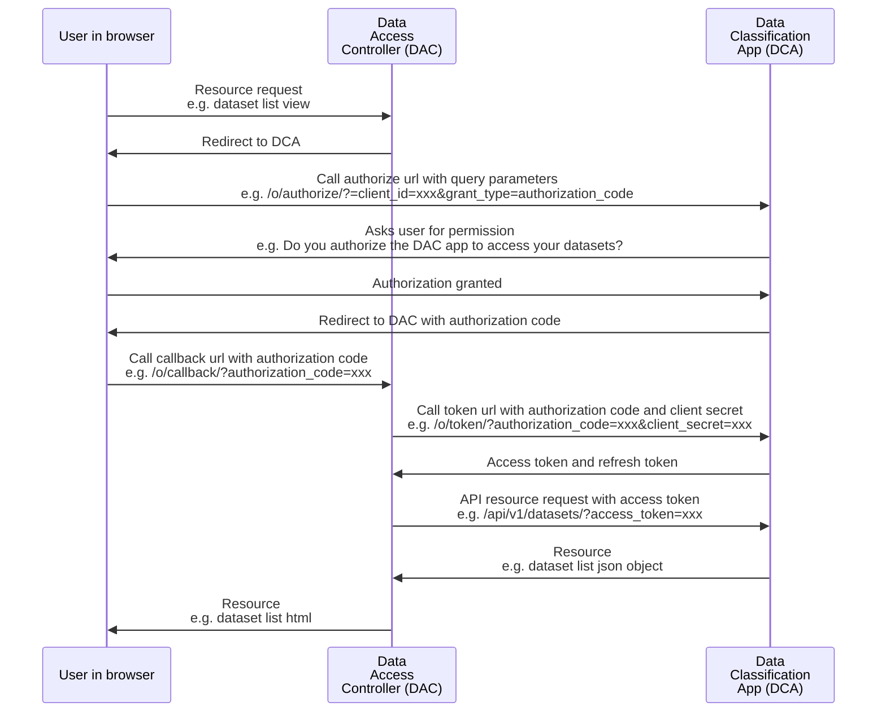
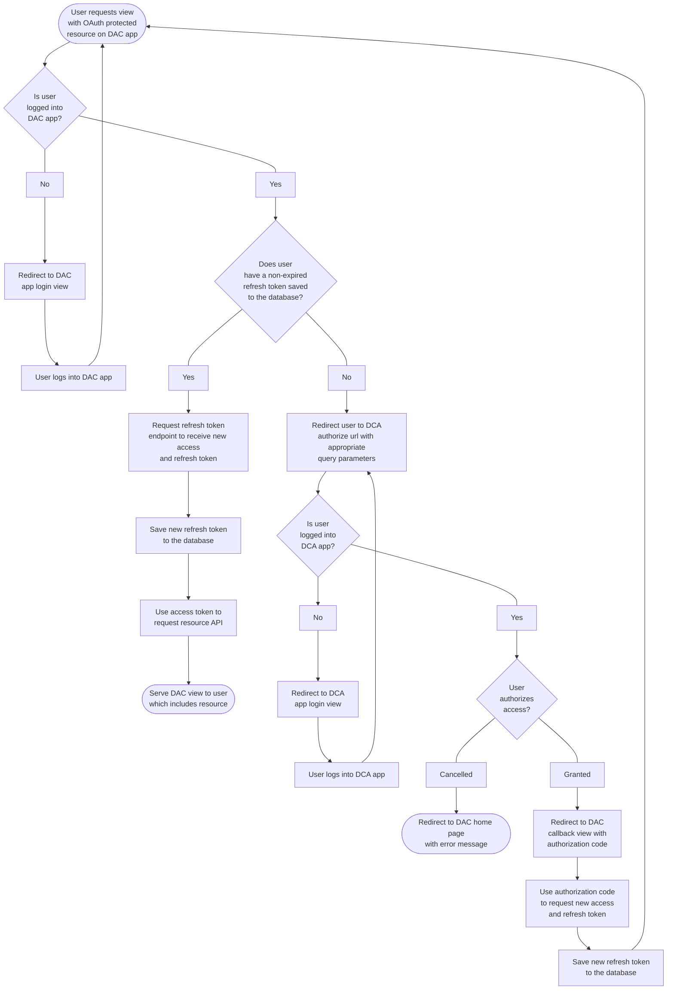

## OAuth

This data-classification-app (DCA) is an [OAuth2](https://oauth.net/2/) provider, it uses the library [django-oauth-toolkit](https://github.com/jazzband/django-oauth-toolkit). Multiple data-access-controller (DAC) clients should be able to authorize to a single data-classification-app instance.

### Sequence diagram
The following is a typical request sequence diagram of the OAuth flow for the successful authorization of a DAC user. It uses the `authorization_code` grant type, some query parameters have been omitted for brevity:

### Proof Key for Code Exchange
[Proof Key for Code Exchange](https://oauth.net/2/pkce/) (PKCE) has been enabled on the OAuth flow, this is an extension to the original OAuth2 protocol which was initially required for mobile applications but is now recommended for server based application. `code_challenge` and `code_challenge_method` query parameters are required for the authorize url call followed up by the appropriate `code_verifier` query parameter when calling the token url. See [here](https://help.aweber.com/hc/en-us/articles/360036524474-How-do-I-use-Proof-Key-for-Code-Exchange-PKCE-) for an example of how to generate the `code_challenge` and `code_verifier` values with python.

### Flowchart
The following is a flowchart which captures the high level user flow for a DAC application user authorizing with a DCA application. This flow assumes that Single-Sign-On (SSO) has not been implemented and the user is required to login to both systems with separate credentials. It is assumed that all requests are well formed and receive a successful response, in the case of an unsuccessful request the user will be shown an error message and be asked to retry their current step:

