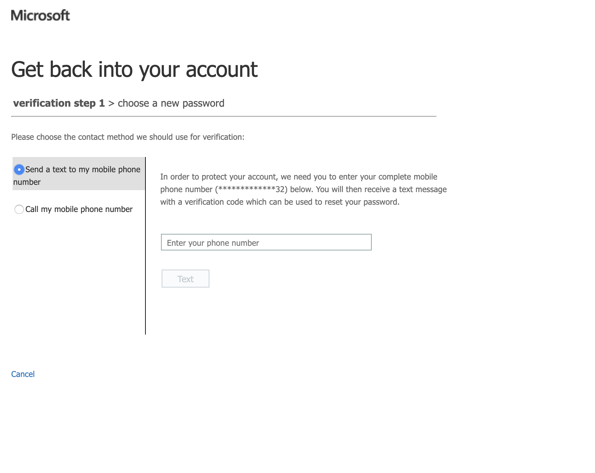
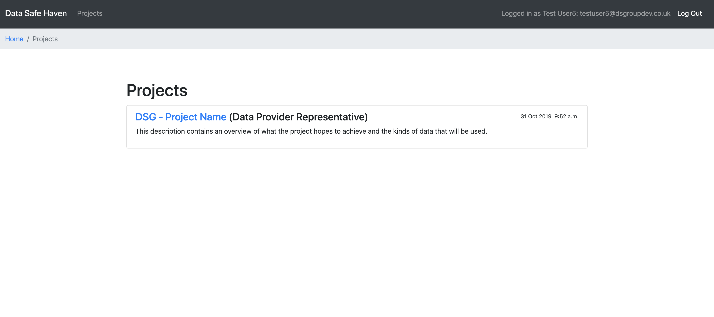
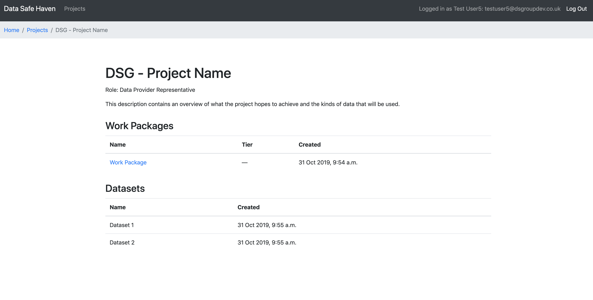
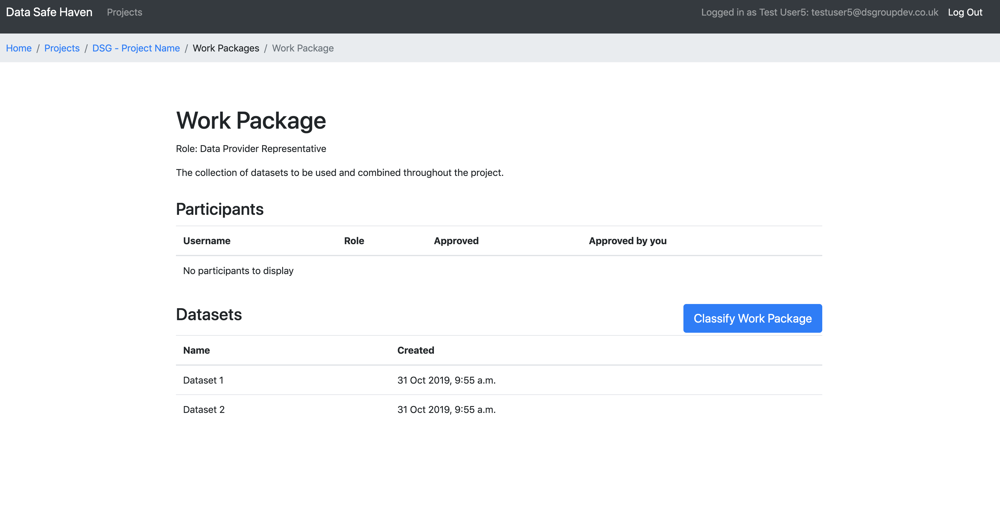
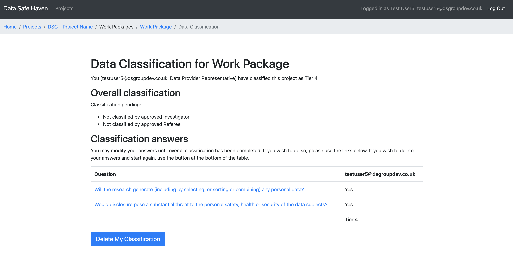

# Classification - Instructions for data provider representatives

Welcome to the Data Safe Haven web-app. This is a tool to help you carry out research projects on secure organisational and personal data, by guiding you through the classification process, and giving instruction on how to handle personal data.

In this documentation we’ll take you, as through the process of getting set on to the web-app, and deciding on the classification of your data.

## Notes
* Projects are created in the management system by a Programme Manager, and an Investigator and Project Manager assigned.
* Programme Managers and Project Managers may add users to groups corresponding to specific projects or work packages through the management framework.
* The Project Manager has the authority to assign Referees and Data Provider Representatives to a project or work package.
* At some tiers, new Referees or members of the research team must also be approved by the Dataset Provider Representative.
* Before joining a project or work package, Researchers, Investigators and Referees must agree to any additional commitments specific to that project or work package.
* Users are removed from a project or work package promptly once their involvement with it ends.

## Why classify?

It is essential that sensitive or confidential datasets are kept secure, to enable analysis of personal data in compliance with data protection law. Classification is based on considering the sensitivity of all information handled in the project, and does not depend only on the input datasets, but on combining information with other information.

In the safe haven model, there are three key roles:

- **Investigator** - The research project lead, this individual is responsible for ensuring that project staff comply with the Environment's security policies.

- **Dataset Provider** - A representative of the organisation who provided the dataset under analysis. The Dataset Provider will designate a single representative contact to liaise with the Investigator, authorised to certify sharing of datasets with the researchers.

- **Referee** - A Referee volunteers to review code or derived data (data which is computed from the original dataset), providing evidence to the Investigator and Dataset Provider Representative that the researchers are complying with data handling practices.

To classify the data to be used in a project, each role representative will go through a series of questions, to help understand the legal sensitivity of the data involved, and the consequences of a data breach.

## Before you get started

Before getting started on the web-app - you should have already had a conversation with your project manager. Based on this conversation they will have:

- Set up an account for you on the web-app
- Set up the project for you
- Assigned you a role
- Added descriptions of any datasets to be used over the course of the research project

## Getting started

Once your project manager has given you the go ahead, you're ready to get started!

You should have provided a phone number to your project manager. If you did not provide your number, your account may not have been set up - please let your project manager know and they will set you up with an account.

Your username will be in the format firstname.lastname. At times, you will need to enter it in the form username@turingsafehaven.ac.uk (so firstname.lastname@turingsafehaven.ac.uk).

Now you can log into your account. During this process, you will need to provide a phone number or an email for account recovery.

To access the web-app, open a new incognito window on your browser, and go to the following address: https://turingsafehaven.azurewebsites.net

Welcome to the data safe haven web app. Press the button to log in to the application.

At the login prompt enter `username@turingsafehaven.ac.uk` and confirm/proceed. (Remember that your username will be in the format firstname.lastname).

The first time you log in, you'll need to reset your password - click `Forgotten my password`. Complete the requested information (a CAPTCHA and the phone number you provided on registration). Make sure you add your number as +44 7XXX, rather than 0 7XXX.

Once you've finished resetting your password, you'll be taken to the front page (if this doesn't happen, reload the web-app on a new incognito browser, and enter in your username and new password).

## Welcome to the web-app

From the front page, you'll be able to see all of the projects to which you've been assigned a role. Click on the project you want to classify data for to see the details.

On the project page, you can see the different datasets to be used throughout the project, the role to which you've been assigned. You can see that the different datasets are each clustered within work packages.

## Work packages

For this Data Safe Haven model, classification is carried out on work packages rather than individual datasets. Classification to a tier is not a property of a dataset, because a dataset's sensitivity depends on the data it can be combined with, and the way in which it is used.

In our model, projects are divided into work packages, which we use here to refer to the activities carried out within a distinct phase of work carried out as part of a project, with a specific outcome in mind. A work package can make use of one or more datasets, and includes an idea of the analysis which the research team intends to carry out, the potential outputs they are expecting, and the tools they intend to use – all important factors affecting the data sensitivity.

## Start classifying

Now that you're all set up on the web-app, you can begin classifying the work package to be used over the project, containing the different datasets. Click on the work package you'd like to classify to see its details.

This page shows you which of the available datasets this work package contains. You can now begin classifying the data - click to classify the work package.

The web-app will now guide you through a series of 'yes or no' questions to classify the work package. After each choice, you can see the question it will bring you to, so you don't accidentally get onto the wrong track. Additional guidance on how to understand and answer each question is given below. If you've made a mistake, or want to cancel your classification at any time - you can click on the grey button and start again later. Work your way through the questions for this work package, answering yes or no for each.

Before you classify the data as a particular tier of sensitivity, the web-app will warn you of the classification you're about to make. You can click previous question to go back, or cancel classification to restart from scratch.

Congratulations, you've classified the work package! This page gives you an overview of the choices you made to arrive at this classification. If you're not happy with any of these choices, you can click on the question to return to this step, or delete the classification to start again. The classification of the dataset will remain pending, until all relevant role representatives have completed their classification, and a consensus has been reached.
